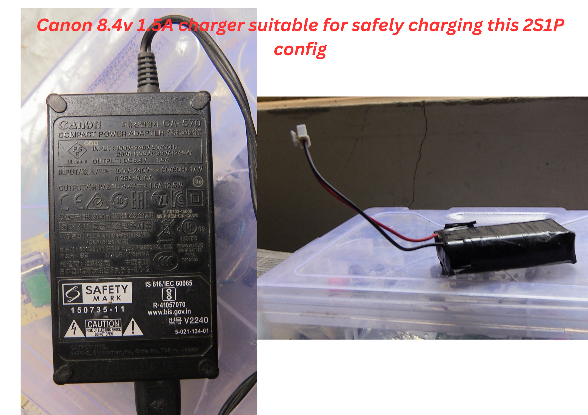
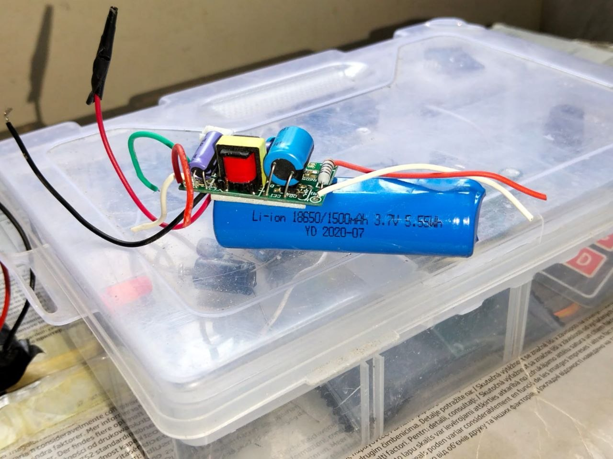

# Lithium-Ion batteries: assembly details, safety tips and practical projects for tinkerers.

## **DISCLAIMER**: All activities described here are done at the owner's risk. 

## What this guide covers

- Basic chemistry and cell types
- Safe handling for hobby projects
- Charging and balancing considerations
- Common DIY builds and ideas

## 
It has become the norm to encounter or require rechargeable batteries when dealing with various systems or circuits. The majority of these batteries are usually Lithium ion based and most often require constant maintenance and careful handling. Here, I explore how I usually deal with them.

For starters here's a quick recap of common battery cell parameters
 - **Nominal voltage** - Standard cell voltage which can also be described as the voltage where a cell stabilizes to.
 - **Max voltage** - maximum safe allowable voltage the cell can be.
 - **Min voltage** - minimum allowable cell voltage.
 - **Capacity** - current producing capabilities of a cell.
 - **Parallel connection** - Similar terminals of cells are connected together (Positive-Positive, negative -negative) which increases capacity.
 - **Series Connection** - Opposite terminals of cells are connected together (Positive - negative, negative- positive) which increases voltage.
Now that we've stated the battery essentials, let's get right into it

There are two main types of Lithium Ion based cells: Lithium Ion- NMC Chemistry & Lithium Ion FePo4 chemistry.
NMC chemistry has a nominal voltage of 3.7 V while LiFePo4 is usually around 3.3/3.2
NMC are usually the ones that need most care as they can easily explode or ignite when not well maintained they however offer more power density and come in the common 18650 package.
LiFePo4 cells are much safer but offer lower power capabilities while also taking more space.
You are likely to find yourself integrating this cells into projects like robots, RC Cars or any those that need to operate off grid like wireless data-logging using microcontrollers.
Among the biggest challenge with Lithium Ion batteries is charging and interfacing.
When interfacing it is common to run into barriers such as translate the battery's voltage into the voltage needed by your device. A good example is trying to integrate an off grid ESP32 with a solar panel and a rechargeable battery. The ESP32 operates at 3.3 V and can often use up to 500mA when Bluetooth and Wi-Fi are integrated. Powering the ESP32 directly with the cell via its Vin pin  wouldn't work as the  Li-ion cell safely operates between 4.2 V - 3.0 V but the ESP32's internal LDO the AMS1117 needs a voltage of at least 4.8V to output 3.3 volts which the cell unfortunately can't provide. The most straightforward option is usually using an adjustable buck converter such as the LM2596 DC-DC Buck converter that can simply convert 3.7V nominal to 3.3V  which the microcontroller needs. However this may be inefficient as the minimum usable voltage would rise to around 3.4V.
This leaves buck-boost converters as the most efficient way to power the project.

One part about Lithium batteries that is always taken with caution is charging. A single Li-ion NMC cell can be charged up to 4.2 V beyond which it may undergo catastrophic failure and explode. Most people would rather go the safe way and purchase commonly available single cell Lithium ion chargers or even modules such as the TP4056 battery charger and protection module which both output CC/CV parameters that are perfect for batteries. A typical module is usually rated at 4.2V 1000mA

However, what's the fun in that? Most hobbyists might find themselves needing to use a battery pack instead of a single cell and it's kind of exhausting to charge a single cell at a time separately from your pack. After creating your Lithium battery pack the next step would be finding a preferrable charger, be it  8.4V(2S), 12.6V(3S) or 16.8(4S). One thing about Lithium ion battery packs  is the need for a battery management system that will monitor voltage, current and temperature but those might be overkill for a simple and straightforward 2S or 3S pack for a robot or RC car. Also, the pack cells usually need to have minimum voltage deviation between them to avoid degradation hence the concept of cell balancing. Luckily, a standalone microcontroller like an ESP32 or Arduino can be used to implement passive balancing as well as measure individual cell voltages via their internal ADC. Bleeding resistors or LEDS can be used to shed some power off higher value cells.

<figure class="zoom-figure">
  
  <figcaption>Click the diagram to open it in a larger viewer .</figcaption>
</figure>

Once you create your pack you don't have to charge each cell individually and can instead charge the whole pack as long as you know the pack parameters. For starters, most manufacturers recommend a C-Rate of 0.5C meaning if a cell is rated 3Ah, you need a charge current of around 1.5 Amperes. Surprisingly, chargers can be obtained all around us. Cameras for example have chargers that are rated for Lithium Ion cells. A Canon XA11 professional camcorder uses removable Lithium battery modules that are rated at 8.4V. When buying one you are provided with an 8.4V 1.5Amps charger that you can easily repurpose for your DIY 2S battery packs.

 One can also use an adjustable power supply to charge the pack though you have to be quite cautious by limiting the charge current and selecting the appropriate charge voltage. A module such as the SK-120 Buck-Boost converter can comfortably charge a pack as well as perform capacity estimation.

Also, there exists various embedded circuits that come packaged within devices such as solar lamps or emergency lights that can safely step down 240V mains into 4.2V, 8.4V or 12.6V according to the number of cells included. These are the best to use as they've been tested in the field and come integrated with chips which offer charge protection for cells.
### Emergency LED lights circuit 

This image demonstrates a simple, well packaged emergency LED lights circuit that uses the single cell Lithium Ion battery cell as a backup during lights off. It interfaces directly with mains and includes an IC that detects power shutdowns as well as safely charges the battery.